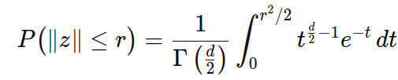
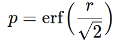
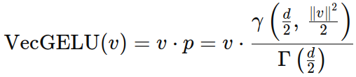
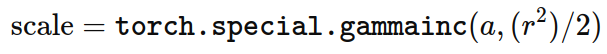

# Vector GELU Activation  
_A Vector-Based Activation Function for Deep Networks_

## Takeaway
Activations are element-wise for a reason -- applying a shrinking to the entire activation vector based on the actions of one is potentially too drastic. Vecgelu seemed to have promising results at first on gpt2, but was eventually dominated. 

fit_1D_plots/fit.png shows several activation functions trying to fit the Cantor function, which I think is a good proxy for the ability to learn algorithms, due to its recursive structure.
The problems with it are clear by looking at fit_1D_plots/fit.png, generated by compare_nonlinearities_on_1D_fit.py -- dividing the norm is not really sensitive enough. Maybe this can be fixed with more layers?

Treating GeLU as probabilistic by sampling and checking whether that exceeds the activation is cool but the noise makes it harder for the function to fit nuance (also see fit.png).
Leaky relu fits the function in a messy way, leading to generalization concerns. PReLU is not really precise
Sigmoid is not really learning complex shapes. Silu doing best on many layers.

## Overview

In many deep neural networks, activations are applied elementwise. A well-known example is GELU, defined for a scalar input x as

  

where Φ(x) is the Gaussian cumulative distribution function (CDF). However, in most networks the activations form high-dimensional vectors rather than independent scalars. The **Vector GELU (vecgelu)** activation function generalizes GELU by operating on entire vectors. It scales a vector v ∈ ℝᵈ by a factor that depends on its Euclidean norm ∥v∥, thereby taking into account the joint behavior of the neurons.

## Motivation & Derivation

### Motivation

- **Global Vector Scaling:**  
  Traditional activations like GELU, ReLU, or SiLU work elementwise. In contrast, vecgelu considers the entire vector v. By scaling v based on its norm r = ∥v∥, we can:
  - Adjust the overall signal based on the “magnitude” of the activation.
  - Encourage more uniform gradient propagation, even in very deep networks without skip connections.
  - Potentially reduce the occurrence of “dead neurons” (i.e. zero activations) compared to ReLU.

- **Empirical Observations:**  
  Experiments on ImageNet with a configurable CNN have shown that:
  - Zero weights occur less frequently over training across all activation functions.
  - The overall weight norm tends to increase over time.
  - Training loss remains relatively consistent across different activations.
  - Average activations are nearly constant and are a function of the chosen activation.
  - Vector-based activations like vecgelu produce very small average activations while still delivering balanced gradients throughout the network.

### Derivation

For an activation vector v ∈ ℝᵈ, let r = ∥v∥. We define a scaling probability p by interpreting r as a threshold for a stochastic gating mechanism. In particular, assume that a d-dimensional standard Gaussian noise vector z is sampled. The probability that ∥z∥ ≤ r is given by

 .

This expression is exactly the normalized (regularized) lower incomplete gamma function evaluated at x = r²⁄2 with parameter a = d⁄2:
 

Notice that when d = 1 this simplifies to

  .

Thus, vecgelu generalizes the scalar GELU to higher dimensions by defining

  .

A stochastic variant can also be derived, where a binary mask is sampled using p and multiplied with v, and the backward pass uses a surrogate gradient proportional to p.

## Implementation

Two implementations are provided in the repository:

### Deterministic Vector GELU

For inputs such as 4D feature maps, the module first divides the input into small subblocks (e.g. 4×4), flattens each subblock into a vector, computes its norm r, and then scales the vector by

  

with a = d⁄2 (where d is the vector dimension). Finally, the scaled subblocks are reshaped back into the original dimensions.

### Probabilistic Vector GELU

A custom autograd function performs a stochastic gating. In the forward pass, for each vector v the norm r and corresponding probability p are computed as above, then a binary mask is sampled (with probability p for 1). The output is v multiplied by the mask. In the backward pass, gradients are scaled by p so that the expected gradient is preserved.

## Experimental Observations

Key findings from our experiments include:

- **Gradient Flow:**  
  In very deep networks, gradients tend to vanish in early layers with standard activations. With vecgelu, gradient magnitudes start high at the output layers and then become more balanced across layers as training progresses, in a way that doesn't happen for GeLU.

- **Activation Norms:**  
  The average activation (i.e. the norm) remains essentially constant during training and is largely determined by the activation function. For vecgelu, the average norm of the activation vectors are sensitive to the weight initialization, but if the weights are scaled so that there the norm is moderately close to the vecgelu cutoff, then the model will learn to create activation norms that are at the vecgelu cutoff. 

- **Activation Behavior:**  
  Zero (or dead) neurons are most prevalent with ReLU, while vector-based activations rarely force activations exactly to zero.

## How to Run

The repository contains two training scripts:

- **train_parallel.py:**  
  Trains a configurable CNN on ImageNet using two parallel processes: one using standard GELU and one using vecgelu. This script logs and plots gradients, activation norms, scales, and loss over training.

- **vanishing_gradients.py:**  
  Similar in structure, this script focuses on monitoring gradient flow and activation norms for different activation functions.

### Prerequisites

- Python 3.9 or newer  
- PyTorch 2.6 or newer  
- Additional libraries: torchvision, datasets (for streaming ImageNet), matplotlib, etc.

### Running the Training

To train using both activation functions in parallel, run:

```bash
python train_parallel.py --num_layers 20
```

This command spawns two processes: one using standard GELU and one using VectorGELUActivation (vecgelu).

## Conclusion

The vector GELU activation function aims to bring a vector-level perspective to activation design. By scaling entire activation vectors using the normalized lower incomplete gamma function, vecgelu provides:
- More balanced gradient flow across deep networks.
- Reduced occurrence of dead neurons.
- Consistent internal statistics despite increasing network depth.

We welcome contributions, feedback, and further experiments exploring the benefits of vector-based activation functions.
